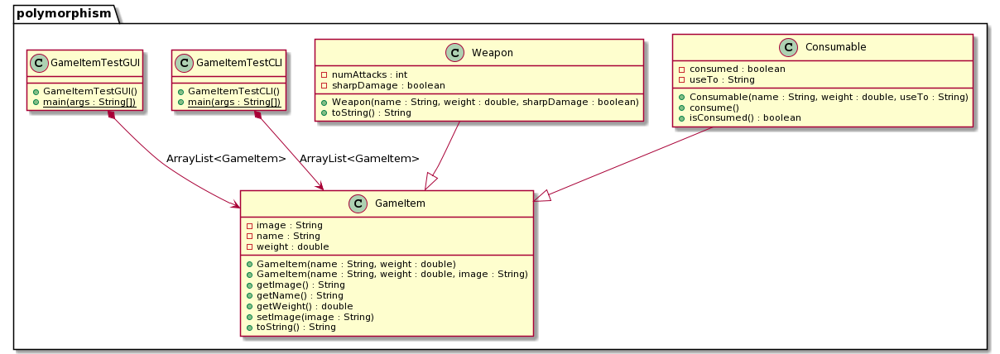

# Prática: Polimorfismo em Java


## Objetivos
Nesta prática você vai exercitar conceitos relacionados a polimorfismo em Java, ao mesmo tempo em que continua a aproveitar o que aprendeu sobre herança, encapsulamento, classes e objetos.

## Pré-requisitos

Consulte o material sobre polimorfismo (<a href="https://docs.google.com/presentation/d/1Tt6vUSIjWtfty1bZdmYqYShlZ_lqIXYfn9MuYiOcb8U/edit?usp=sharing">slides</a> | <a href="https://drive.google.com/file/d/1bhFGge-oVctxXaXDbUzsN9afseP4ZWiD/view?usp=sharing">vídeo</a>) antes desta prática.

## Entrega

Esta prática vai ser entregue em um repositório específico no GitHub Classroom. Clique [aqui](https://classroom.github.com/a/Ib2BLvIn) para criá-lo. 


## Preparação

Para começar, baixe o arquivo [polymorphism.zip](src/polymorphism.zip) ou, se você fez fork do repositório da disciplina, sincronize os repositórios seguindo estas [instruções](https://docs.github.com/en/github/collaborating-with-pull-requests/working-with-forks/syncing-a-fork) (também possível via [linha de comando](https://www.freecodecamp.org/news/how-to-sync-your-fork-with-the-original-git-repository/).

Neste código fornecido, há uma hierarquia de classes em Java inspiradas em jogos tipo RPG:
- [GameItem.java](src/polymorphism/app/src/main/java/polymorphism/GameItem.java): superclasse que representa itens que podem ser colocados em uma sacola;
- [Weapon.java](src/polymorphism/app/src/main/java/polymorphism/Weapon.java): subclasse de GameItem representando uma arma;
- [Consumable.java](src/polymorphism/app/src/main/java/polymorphism/Consumable.java): subclasse de GameItem representando um item consumível (comida, poção, etc.)
- [GameItemTestCLI.java](src/polymorphism/app/src/main/java/polymorphism/GameItemTestCLI.java): programa com interface textual (command-line) que usa as classes acima
- [GameItemTestGUI.java](src/polymorphism/app/src/main/java/polymorphism/GameItemTestGUI.java): programa com interface gráfica (com Swing) que usa as classes acima

Estas classes estão representadas neste diagrama em UML (Unified Modeling Language):




## Exercícios CLI (Command Line Interface)


1. Em um terminal de comandos, compile o código e execute a classe `GameItemTestCLI` usando Gradle:
  ```
  gradle run
  ```

2. Observe que o método `main` dessa classe cria uma coleção (ArrayList) de objetos e implementa diferentes formas de iterar sobre eles (veja comentários no código). 

2. Observe que, nas linhas de código que executam `System.out.println` com objetos `Consumable`, não são mostrados todos os atributos destes objetos. Isso é porque o método `toString` não foi sobrescrito.

3. Altere [Consumable.java](src/polymorphism/app/src/main/java/polymorphism/Consumable.java) para que `GameItemTestCLI` mostre todos os atributos de objetos `Consumable`, a exemplo do que é feito em [Weapon.java](src/polymorphism/app/src/main/java/polymorphism/Weapon.java). 


3. Em [GameItemTestCLI.java](src/polymorphism/app/src/main/java/polymorphism/GameItemTestCLI.java), no último laço, há uma linha comentada que causa erro de compilação. Adicione um comentário no código explicando o motivo do erro, com base nos conceitos do paradigma orientado a objetos.


5. Ao final de [GameItemTestCLI.java](src/polymorphism/app/src/main/java/polymorphism//GameItemTestCLI.java), adicione um código que calcule o peso total da sacola, considerando todos os itens que estão dentro dela. 

6. Em [Consumable.java](src/polymorphism/app/src/main/java/polymorphism/Consumable.java), quando o item é consumido, seu peso fica inalterado. Altere o código para zerar o peso do item quando ele for consumido. Atenção ao encapsulamento! 


## Exercícios GUI (Graphical User Interface)


1. O programa [GameItemTestGUI.java](src/polymorphism/app/src/main/java/polymorphism/GameItemTestGUI.java) mostra dados de objetos `GameItem` em uma interface gráfica. Para executar o `main` deste programa, altere o arquivo `build.gradle`, na linha que indica a `mainClass`, substituindo `GameItemTestCLI` por `GameItemTestGUI`.

2. Em um terminal de comandos, execute o programa com interface gráfica usando Gradle:
  ```
  gradle run
  ```

3. Veja o que acontece a cada clique no botão Next. Confira o código [GameItemTestGUI.java](src/polymorphism/app/src/main/java/polymorphism/GameItemTestGUI.java) linha por linha e compare com a saída observada.


4. Agora você vai usar outro código de exemplo fornecido em [helloimage.zip](src/helloimage.zip). Baixe e descompacte o arquivo, ou simplesmente abra o projeto caso você tenha feito fork do repositório da disciplina.

5.  No programa [HelloImageSwing.java](src/helloimage/app/src/main/java/helloimage//HelloImageSwing.java), há um exemplo simples que mostra uma imagem (ícone) na interface gráfica. Compile e execute este programa em um terminal (use `gradle run`). 

6. Usando este exemplo como referência, sua missão agora será alterar o código de [GameItemTestGUI.java](src/polymorphism/app/src/main/java/polymorphism/GameItemTestGUI.java)  para setar e mostrar, na interface gráfica, imagens associadas a cada item na sacola. Consulte a documentação de referência do pacote Swing do JDK Java e altere o visual da interface gráfica ao seu gosto! 


