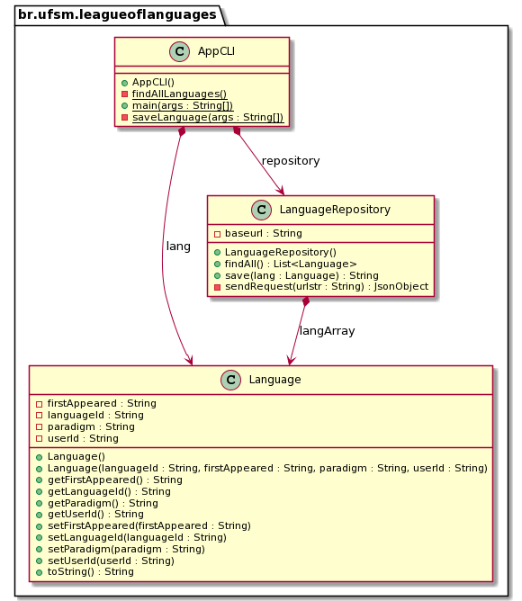

# Trabalho 1: Linguagens para a League of Languages


## Contexto


Linguagens de programação são poderosas ferramentas por trás de tecnologias que movem o mundo, capazes de expressar algoritmos e soluções para os mais variados tipos de problemas (até para os que não existem ainda!). Linguagens são "seres" abstratos e artificiais, mas são (até então) criadas por pessoas e têm um ciclo de vida análogo ao natural: linguagens nascem com algumas características, interagem com o ambiente, evoluem, (algumas) reproduzem-se e (mais cedo ou mais tarde) morrem (ou hibernam?). 

No mundo artificial das linguagens, pessoas que conhecem suas características adquirem poderes e influenciam o futuro desse mundo. Essas pessoas formam a "League of Languages". Os valiosos dados desta liga são mantidos em um local secreto e alimentados por seus integrantes, usando código orientado a objetos em Java :smiley:.


## Objetivo

Neste trabalho, você, integrante da liga, vai contribuir para a League of Languages de duas formas: (1) aprimorando programas em Java que gerenciam dados da liga e (2) usando estes programas para contribuir com dados para a liga.


## Código existente

- Os dados da liga são mantidos neste [local secreto](https://docs.google.com/spreadsheets/d/1UceqvZgF2dTHRFzYO_bY6fE3oOht02-8tkCgcRMb24k/edit?usp=sharing), na nuvem da Google.

- Nos servidores da nuvem Google, está hospedado um serviço que atende requisições dos membros da liga (clientes). Essas requisições são enviadas pela rede usando o protocolo HTTPS, seguindo algumas convenções. 

- Para facilitar o trabalho da liga, é possível enviar requisições diretamente do navegador Web, por exemplo copiando e colando a linha abaixo no seu navegador favorito:
  ```
  https://script.google.com/macros/s/AKfycbxFHJM5G11Wc4SRwl4Gh3VKun9_QzlfmFAthGI0rihrbd9maY3c3nb8XFaE020HMYQc/exec?action=getLanguages
  ```

- O serviço responde às requisições usando o formato [JSON](https://en.wikipedia.org/wiki/JSON). Nesse formato, os dados são descritos por pares "atributo-valor". Por exemplo, em:
  ```json
  {"languageId":"java","firstAppeared":"1995"}
  ```
  o atributo "languageId" tem o valor "java" e o atributo "firstAppeared" tem o valor "1995".

- O código Java fornecido está [neste zip](LeagueOfLanguages.zip) e também pode ser obtido se você fizer fork do [repositório da disciplina](http://github.com/andreainfufsm/elc117-2021b), cloná-lo localmente e configurá-lo para mantê-lo sincronizado, conforme [estas instruções](https://www.freecodecamp.org/news/how-to-sync-your-fork-with-the-original-git-repository/).

- O código Java fornecido é formado pelas seguintes classes:
  - [Language](LeagueOfLanguages/app/src/main/java/br/ufsm/leagueoflanguages/Language.java): define a representação de uma linguagem de programação 
  - [LanguageRepository](LeagueOfLanguages/app/src/main/java/br/ufsm/leagueoflanguages/LanguageRepository.java): envia 2 tipos de requisições ao servidor e processa respostas recebidas
  - [AppCLI](LeagueOfLanguages/app/src/main/java/br/ufsm/leagueoflanguages/AppCLI.java): interface de linha de comando (CLI - _Command Line Interface_) para usuários avançados como você! :smiley: 

- O diagrama de classes abaixo ilustra as associações entre as classes descritas acima.


- O código fornecido está organizado como um projeto Gradle, reconhecido pelos mais importantes IDEs Java. Gradle é um _build system_ (sistema que automatiza tarefas como compilação, testes e empacotamento de código), assim como Maven e Ant. Gradle pode ser usado tanto via interface gráfica do IDE como via linha de comando em terminal.

- Para compilar e executar o projeto, você pode usar o seguinte comando:
  ```
  gradle run -PchooseMain=br.ufsm.leagueoflanguages.AppCLI --args="saveLanguage c 1972 Multi-paradigm%3A+imperative+%28procedural%29%2C+structured username"
  gradle run -PchooseMain=br.ufsm.leagueoflanguages.AppCLI --args="findAllLanguages"
  ```
  Esse comando especifica a classe principal (que contém o método `main`) e os argumentos que devem ser passados para a classe.

- Para enviar um argumento contendo espaços ou outros caracteres especiais, é preciso **codificar** o texto, como no exemplo acima (veja o quarto argumento, que especifica o paradigma). Para isso, você pode usar [este serviço](https://www.w3schools.com/tags/ref_urlencode.ASP).

## Sua missão

Você deve iniciar o trabalho obtendo e executando o código existente. É normal que surjam dificuldades nesta etapa, dependendo do IDE usado. 

Depois, você deverá:

1. Modificar o programa AppCLI para mostrar a lista de linguagens cadastradas em ordem crescente de ano de aparição (atributo `firstAppeared`).

3. Criar um programa com interface gráfica para cadastro de linguagem, para agradar outros perfis de usuários. O método principal deste programa deverá ficar numa classe nomeada AppGUI. 

4. Contribuir com dados válidos sobre (no mínimo) 2 novas linguagens ainda não cadastradas, usando sua identificação no GitHub como valor do atributo userId. 

Obs.: Não tenha medo e muito menos vergonha de enviar dados de teste para o servidor. Você (ou qualquer integrante da liga) poderá solicitar a remoção de um dado via Discord, já que ainda não temos interface para edição. A validação dos dados será feita manualmente de tempos em tempos.

## Extras

Se quiser praticar mais, você também pode:

1. Incrementar o AppGUI para também mostrar a lista de linguagens cadastradas, usando qualquer componente à sua escolha (por exemplo: JTestArea, JTable, ...).

2. Implementar o encoding do texto enviado ao serviço, substituindo espaços e outros caracteres conforme o esquema descrito [aqui](https://www.w3schools.com/tags/ref_urlencode.ASP).


## Entrega


- Entregue o projeto Gradle completo em: https://classroom.github.com/a/zOy0GhdC
- Deadline: segunda-feira, 15/11/2021


